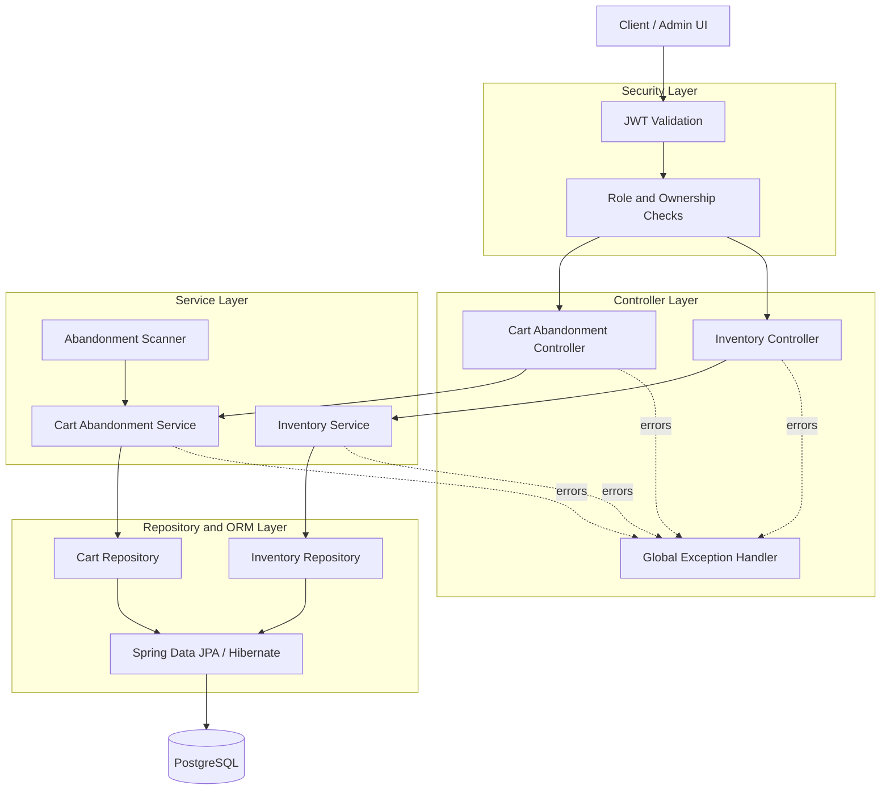
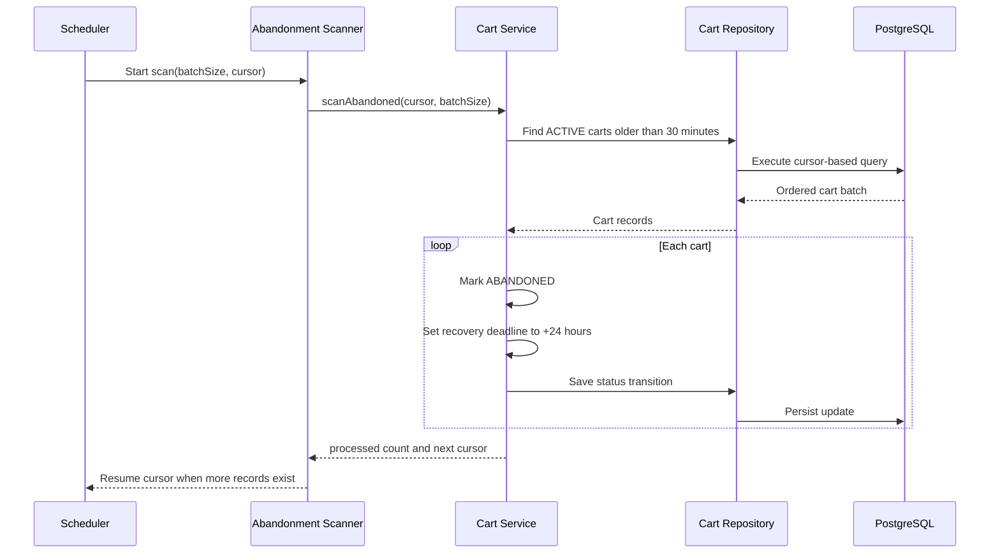
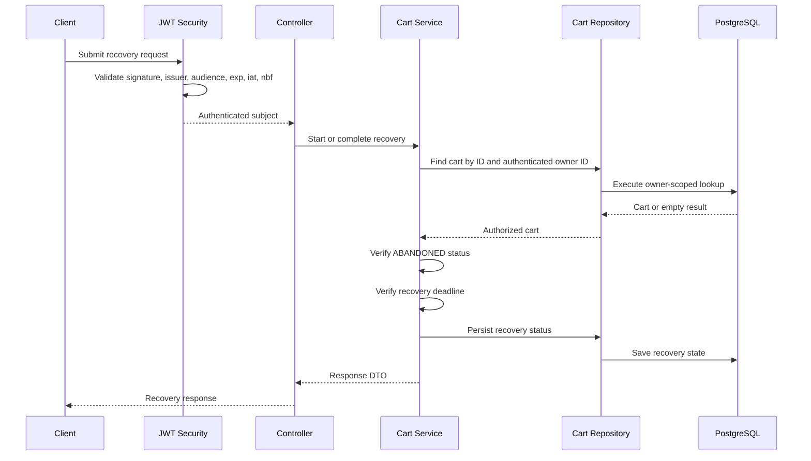
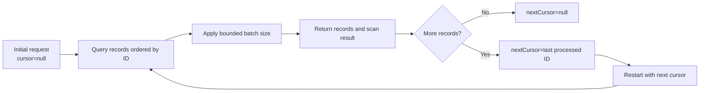
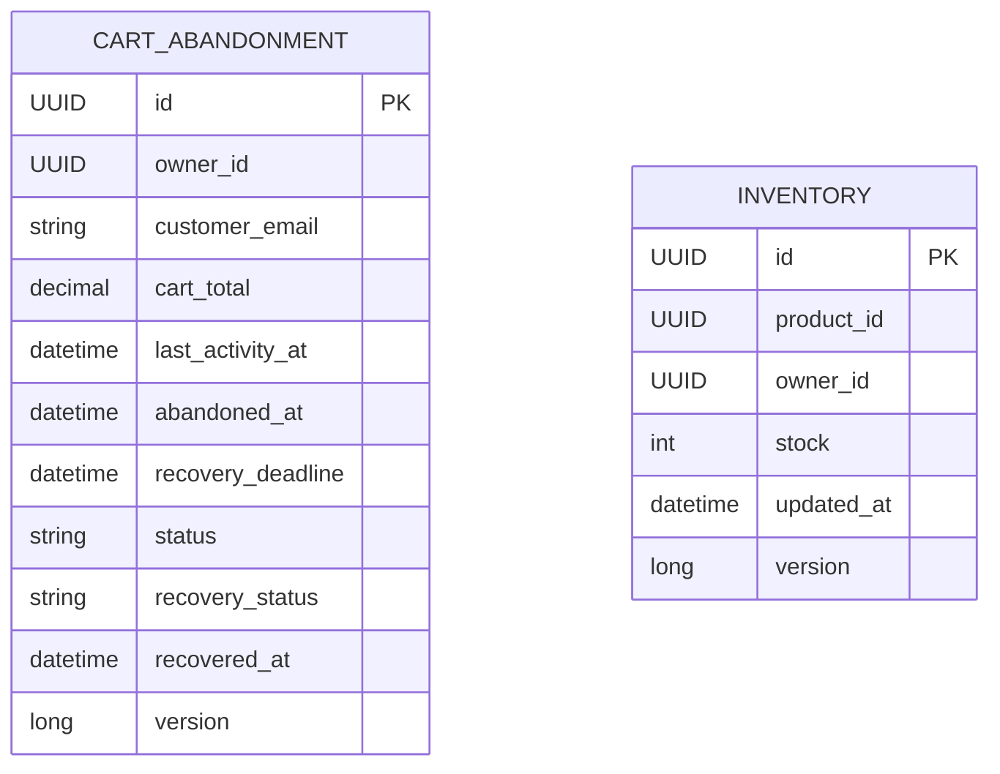

# RetailEdge Architecture and Flow

## System Architecture

## Abandonment Detection Flow

## Recovery Flow

## Cursor Pagination and Restartable Scans

## Data Model

## Security and Data Rules

- JWT subject determines the resource owner; clients cannot submit an arbitrary owner ID.
- JWT signature, issuer, audience, expiration, issued-at, and not-before claims are validated.
- Repository queries are owner-scoped to prevent Broken Object Level Authorization.
- Create, stock mutation, delete, and administrative scan operations require the appropriate role.
- DTOs whitelist request and response fields; entities are not exposed directly.
- Carts become abandoned after 30 minutes of inactivity.
- Recovery is allowed only within the 24-hour recovery window.
- Cursor pagination and bounded batch sizes prevent unbounded database reads.
- PostgreSQL persistence uses Spring Data JPA and Hibernate.
- Currency values use `BigDecimal`.
